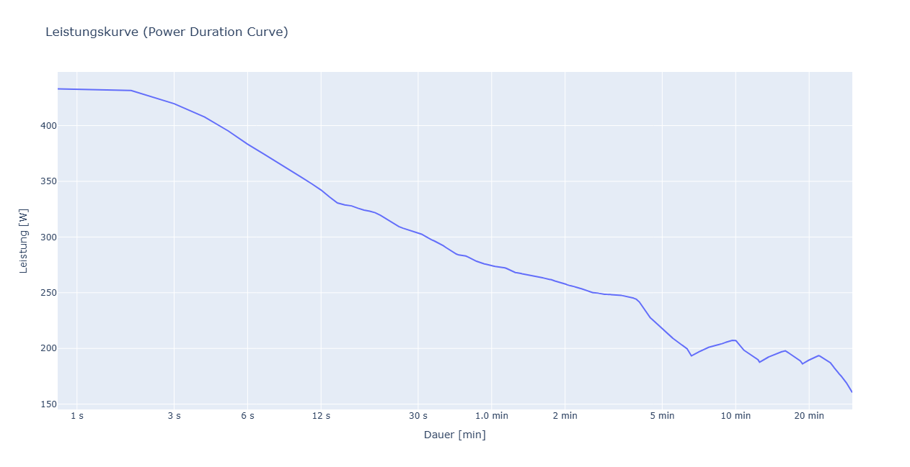

# Leistungskurve

## Anwendung
- Um diese Funktion nutzen zu können muss das Projekt einmalig mit dem Befehl `pdm install` gestartet werden.
- nach Ausführen des Befehls `pdm run main.py`und dem Eingeben des Dateipfads zur CSV-Datei oder dem hinzufügen einer NumPy-Variable sollte sich im Standardbrowser ein Plotly-Diagramm öffnen, welches die Leistungskurve anzeigt.

## Ergebnis
- Wenn die Eingaben alle korrekt sind und die Installation erfolgreich war, sollte das Diagramm der __Leistungskurve__ wie folgt aussehen:

